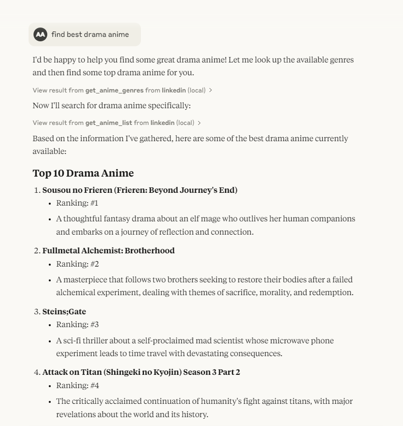

# Example Anime MCP  
A simple example of an MCP (Message Command Protocol) server that returns anime titles.  

## How to Use  
This MCP server is configured to return anime titles based on a query.   





## Installing MCP and Setting Up the Server  
To install and run the Anime MCP server, follow these steps:  

### Prerequisites  
We recommend using **uv** to manage your Python projects.  

### Setting Up a New `uv`-Managed Project  
If you haven’t created a `uv`-managed project yet, initialize one with:  
```sh
uv init mcp
cd mcp
```  

### Installing MCP  
To add MCP to your project dependencies, run:  
```sh
uv add "mcp[cli]"
```  
Alternatively, if you use `pip`, install MCP with:  
```sh
pip install "mcp[cli]"
```  

## Running the MCP Server  

### Installing and Running in Claude Desktop  
If you're using Claude Desktop, you can install and run the server with:  
```sh
mcp install anime_mcp.py
```  

To test the server using the MCP Inspector:  
```sh
mcp dev anime_mcp.py
```  

### Running the Standalone MCP Development Tools  
To run the `mcp` command with `uv`:  
```sh
uv run mcp
```  

## Example `mcpServers` Configuration  
Here’s an example configuration to run the Anime MCP server:  
```json
{
  "mcpServers": {
    "anime_mcp": {
      "command": "uv",
      "args": [
        "run",
        "--with",
        "mcp[cli]",
        "mcp",
        "run",
        "D:\\mcp\\anime_mcp.py"
      ]
    }
  }
}
```  
    
